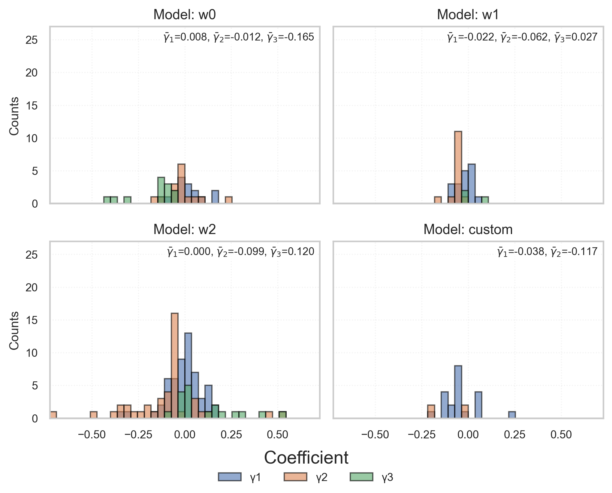

# AI Narrative Index (AINI)

**Deutsche Version:** [hier](https://github.com/LarsIX/narrative_index/blob/main/README.md)

---

## Overview

This repository documents the complete research and implementation pipeline for constructing the **AI Narrative Index (AINI)** — a time series measuring how Artificial Intelligence (AI) is represented in financial news.  
To the author’s knowledge, this is the **first technology-specific hype index** that quantitatively captures narrative attention and sentiment toward AI.

The project integrates **Transformer-based NLP**, **deep learning**, and **econometric inference** within a **modular and reproducible architecture**.


*Note: The flowchart is shown in English, as the underlying research and thesis are written in English.*

---

## Research Goals

- Develop multiple **Transformer-based variants** of the AINI (different context windows and FinBERT fine-tuning)
- Quantify **narrative hype effects on financial markets** using Granger causality
- Ensure **scientific validity** through double annotation, diagnostic testing, and resampling-based inference

---

## Construction of the AINI

The index combines **manual annotation**, **fine-tuned language models**, and **lexicon-based methods** to identify and quantify AI-related narratives in financial texts.

### 1. Manual Annotation & Fine-tuning of FinBERT

- Creation of a double-annotated dataset to identify **AI-related articles**  
- Fine-tuning of a **FinBERT model** on this dataset for binary classification (“about AI” / “not about AI”)  
- Application of the model to **Wall Street Journal (WSJ)** articles (2023–2025)  
- Execution of a **sentiment analysis** using [ProsusAI/finbert](https://huggingface.co/ProsusAI/finbert) on identified narratives  
- Normalization, aggregation, and exponential smoothing of sentiment outputs to produce a **daily time series**

### 2. Lexicon-based Snippet Selection

- Pre-selection of AI-related paragraphs through a **rule-based keyword search**
- Extraction of multiple **context windows** around flagged keywords
- Application of FinBERT to these snippets, followed by **aggregation and smoothing** into daily scores
- Construction of additional AINI variants for robustness analysis

---

## Statistical Inference

The interaction between narratives and financial variables is analyzed using **econometric methods**.

### Stationarity Tests
- Augmented Dickey-Fuller (ADF)  
- Phillips-Perron (PP)  
- KPSS  

All time series were tested for stationarity and differenced when required.

### Granger Causality

To assess directional relationships between AINI and stock returns, Granger causality tests are employed.  
The methodology includes:

- **Wild Residual Bootstrap** (10,000 resamples with Rademacher weights) → robust empirical p-values  
- **Benjamini–Hochberg correction** to control the false discovery rate across multiple tests  

Example regression specification:


All models were also estimated in the **reverse direction** (log return → AINI) to assess potential feedback effects from market movements to narratives.

*Control variables:* daily growth of article counts, S&P 500 index, SOX index.  
*Lag lengths:* l = ρ ∈ {1, 2, 3}

---

## Results (Selected)

### AI Narrative Index (AINI) – Variant Comparison

The variants differ in the size of the applied context window:  
**w₀** uses only the sentence containing an AI keyword (no context integration),  
**w₁** extends the window bidirectionally by one sentence before and after the hit,  
**w₂** covers two surrounding sentences,  
and **custom** processes the entire article (headline + main text, up to 512 tokens).  
Larger context windows capture **greater semantic depth** and **narrative coherence** across text segments.


### Significant Effects by Asset and Period

The following figure shows significant Granger-causality results (AINI → returns):


### Distribution of Regression Coefficients

The distribution of γ-coefficients illustrates the dispersion and direction of AINI effects:



---

## Key Findings

**Model Behavior**
- Larger context windows tend to produce more negative sentiment scores.
- The fine-tuned FinBERT model achieved a weighted Macro-F1 score of **0.92** on the test set.
- The lexicon-based variant performed comparably on the validated dataset.

**Economic Results**
- The AINI series (w₀–w₂) are non-stationary in 2025 → possible regime shift indicator.  
- Consistent with the Efficient Market Hypothesis, most regressions are insignificant.  
- For significant cases, AINI explains only a small share of overall variance but increases short-term return volatility by a factor of 5–35.  
- In the reverse direction (returns → AINI), some assets exhibit strong narrative responses (up to 85% explained variation).

**Limitations**
- Based solely on WSJ articles (2023–2025)
- Focused on high-growth assets (e.g., NVIDIA)
- Short sample period
- No modeling of non-linear effects

---

## Project Structure

The implementation follows a **modular, MLOps-inspired architecture**.  
All components — from data collection to econometric analysis — are **separated, reproducible, and accessible via CLI scripts**.

```text
AI_narrative_index/
│
├── src/
│   ├── fetch_data/
│   │   ├── load_financial_data.py              # Download financial market data
│   │   ├── wsj_archive_crawler.py              # Crawl WSJ archive pages, collect URLs
│   │   └── wsj_archive_scraper.py              # Download full article contents
│   │
│   ├── preprocessing/
│   │   ├── clean_database.py                   # Filter articles by section, length, duplicates
│   │   ├── corpus_cleaning.py                  # Remove UI/meta elements from text
│   │   ├── reduce_db_for_sentiment.py          # Extract subset for sentiment analysis
│   │   ├── combine_article_dbs.py              # Merge yearly DBs into one CSV
│   │   ├── fix_article_ids.py                  # Ensure uniquenes of article IDs
│   │   ├── section_filtering.py                # Remove irrelevant WSJ sections
│   │   └── simple_ai_filter.py                 # Mark articles with AI keywords
│   │
│   ├── annotation/
│   │   ├── comparing_annotations.py            # Resolve annotator conflicts
│   │   └── label_articles.py                   # Interactive annotation tool (AI/Hype)
│   │
│   ├── modelling/
│   │   ├── ai_windows.py                       # Extract contextual snippets around AI terms
│   │   ├── calculate_summary_statistics.py     # Descriptive stats for AINI
│   │   ├── compute_extrema.py                  # Extremes (Min/Max) of AINI variants
│   │   ├── construct_AINI_variables.py         # Build AINI time series (normalization, EMAs)
│   │   ├── CustomFinBERT.py                    # Custom FinBERT with dropout & class weights
│   │   ├── stationarity_testing.py             # Stationarity tests (ADF, PP)
│   │   ├── estimate_granger_causality.py       # Granger causality with bootstrap
│   │   ├── estimate_transfer_entropy.py        # infer KSG-based Entropy (legacy)
│   │   ├── format_te_gc_inputs.py              # prepare data of KSG estimator (legacy)
│   │   ├── predict_binary_AINI_FinBERT.py      # AI vs. Non-AI classification
│   │   └── predict_AINI_FinBERT_window.py      # Context-based sentiment inference
│   │
│   ├── visualizations/
│   │   ├── construct_tables.py                 # create reporting for Granger causality
│   │   ├── plot_functions.py                   # plot various AINI series
│   │   ├── plot_granger_causality.py           # plot regression results
│   │   ├── prepare PPT.py                      # buils PowerPoint regression tables
│   │   ├── read_articles.py                    # visualize article content
│   │   └── stationarity_report.py              # create reporting for KPSS, ADF & PP
│   │   
│   │
│   ├── databases/
│   │   └── create_database.py                  # Create SQL DB structure
│   │
│
├── scripts/                                    # CLI wrappers for reproducibility
│   ├── __init__.py
│   ├── estimate_collider_granger_causality.py
│   ├── init_jvm.py
│   ├── run_clean_database.py
│   ├── run_combine_article_dbs.py
│   ├── run_construct_AINI_variables.py
│   ├── run_create_database.py
│   ├── run_estimate_granger_causality.py
│   ├── run_estimate_ols.py
│   ├── run_fix_article_ids.py
│   ├── run_load_financial_data.py
│   ├── run_naive_labeling.py
│   ├── run_predict_AINI_FinBERT_prelabeled_fin.py
│   ├── run_predict_AINI_FinBERT_window.py
│   ├── run_predict_binary_AINI_FinBERT.py
│   ├── run_predict_investor_sentiment.py
│   ├── run_reduce_db_for_sentiment.py
│   ├── run_stationarity_testing.py
│   ├── run_wsj_crawler.py
│   └── run_wsj_scraper.py
│ 
├── notebooks/
│   ├── analyse_gc_results.ipynb               # Analyse Granger causality results
│   ├── benchmark_windows.ipynb                # Compare flagging models
│   ├── calc_CAPM.ipynb                        # Run CAPM regressions
│   ├── compare_annotations.ipynb              # Compare annotation windows
│   ├── compare_class_variants.ipynb           # Investigate different classification setups
│   ├── exploratory_analysis_aini.ipynb        # Analyse AINI time series 
│   ├── exploratory_custom_fin.ipynb           # Analyse results of finetuned FinBERT 
│   ├── exploratory_analysis_raw_res.ipynb     # Analyse FinBERT annotations
│   ├── exploratory_analysis_wsj.ipynb         # Analyse WSJ-data
│   ├── label_manually.ipynb                   # Annotate articles
│   ├── sample_articles.ipynb                  # Sample articles for annotation
│   ├── stationarity_evaluation.ipynb          # Investigate stationarity issues
│   ├── subset_for_latex.ipynb                 # Prepare for LaTex reporting (legacy)
│   ├── train_FinBERT_annot.ipynb              # Finetune custom FinBERT
│   └── visualize_aini_variables.ipynb         # Inspect AINI (legacy)
│
├── data/
│   ├── raw/                                   # Raw data (articles, financials)
│   ├── interim/                               # Intermediate data (annotation, subsets)
│   └── processed/
│       ├── variables/                         # Final variables (AINI, GC, TE etc.)
│       └── articles/                          # Cleaned article texts
│
└── models/                                    # Fine-tuned FinBERT


# Data Catalog

This catalog documents the datasets used and generated in the **AI Narrative Index (AINI)** project.  
The structure follows **MLOps best practices**:

- **Traceability:** every dataset is linked to its generating script  
- **Reproducibility:** the raw → interim → processed pipeline is fully transparent  
- **Versioning:** placeholders `{year}` / `{vers}` separate time ranges and versions  
- **Auditability:** all transformations are fully documented  

---

## 📂 `data/raw/`

Immutable raw data after collection.  
Single source of truth for all downstream steps.  

### 📂 `articles/`

| File | Description | Origin |
|------|-------------|--------|
| `articlesWSJ_{year}.db` | WSJ raw databases with `articles` and `articles_index` | Created via `create_database.py`, filled by `wsj_archive_scraper.py` & `wsj_archive_crawler.py` |

### 📂 `financial/`

All files contain OHLCV data: `Date`, `Ticker`, `Open`, `High`, `Low`, `Close`, `Adj Close`, `Volume`.  
Generated with `load_financial_data.py`.  

| File | Description |
|------|-------------|
| `{TICKER}_full_2023_2025.csv` | Daily OHLCV for individual tickers (e.g., `AAPL`, `NVDA`, `MSFT`) |
| `full_daily_2023_2025.csv` | Aggregated OHLCV data for all tickers |

---

## 📂 `data/interim/`

Storage for experiments, human-in-the-loop tasks, and partially processed data.  
Used for **annotation, sampling, and benchmarks**.  

### Sampling & Annotation

| File | Description | Origin |
|------|-------------|--------|
| `articles_WSJ_batch_{1–4}.csv` | Random samples for annotation | `sample_articles.ipynb` |
| `articles_WSJ_sub500.csv` | Initial 500-article subset (basis for batches) | `sample_articles.ipynb` |
| `articles_WSJ_batch_{n}_annotator.csv` | Labels from professional annotator | External → Import |
| `articles_WSJ_batch_{n}_author.csv` | Author’s labels | `label_manually.ipynb` |
| `*_subsample_author.csv` | 25% author subsample | Manual selection |

---

## 📂 `data/processed/`

Canonical datasets for **training, evaluation, and analysis**.  
Noise and disagreements are resolved.  

### 📂 `articles/`

| File | Description | Origin |
|------|-------------|--------|
| `articlesWSJ_clean_{year}.db` | Cleaned WSJ articles (noise removed) | `clean_database.py` (patterns from `corpus_cleaning.py`) |
| `annotated_subsample_WSJ_final.csv` | Consensus labels after conflict resolution | `compare_annotations.ipynb` |
| `articles_WSJ_batch_{n}_final.csv` | Final agreed batch labels | `compare_annotations.ipynb` |

---

## 📂 `variables/`

Model outputs, diagnostics, and statistical results.  
All **results are reproducible from code**.  

| File | Description | Origin |
|------|-------------|--------|
| `w0_AINI_variables.csv`, `w1_AINI_variables.csv`, `w2_AINI_variables.csv`, `binary_AINI_variables.csv` | AINI variables (normalized + EMA α=0.2/0.8) | `construct_AINI_variables.py` |
| `FinBERT_AINI_prediction_{year}_windowsize_{n}.csv` | Context window predictions (−1, 0, 1) | `predict_AINI_FinBERT_window.py` |
| `FinBERT_binary_prediction_{year}.csv` | Binary FinBERT predictions on pre-labeled data | `predict_AINI_FinBERT_prelabeled_fin.py` |
| `granger_causality_{spec}.csv` | GC results (AINI ↔ returns) with 10k bootstrap + FDR | `estimate_granger_causality.py` |
| `ols_sameday_mbboot_fdr_{spec}.csv` | Contemporaneous OLS effects | `estimate_OLS.py` |
| `diagnostics_{spec}.csv` | OLS residual diagnostics (Ljung-Box, BG, ARCH-LM, …) | `ols_residual_diagnostics.py` |
| `combined_te_results_window_1.csv` | Transfer Entropy results | `calc_entropy.py` |
| `extrema.csv` | Min/Max of AINI variables | `exploratory_analysis_aini.ipynb` |
| `{vers}_AINI_variables.csv` | AINI measures (normalized + EMA, relative) | `run_construct_AINI_variables.py` |
| `naive_AI_labels_{year}.csv` | Dictionary-based AI relevance labels | `label_articles.py` (`naive_labeling`) |
| `n_articles.csv` | Number of articles per day | `exploratory_analysis_aini.ipynb` |

---

## Note

The scraped contents are used exclusively for academic research and are **not** shared publicly for copyright reasons.  
The trained models can be shared upon request (depending on size and usage context).  
