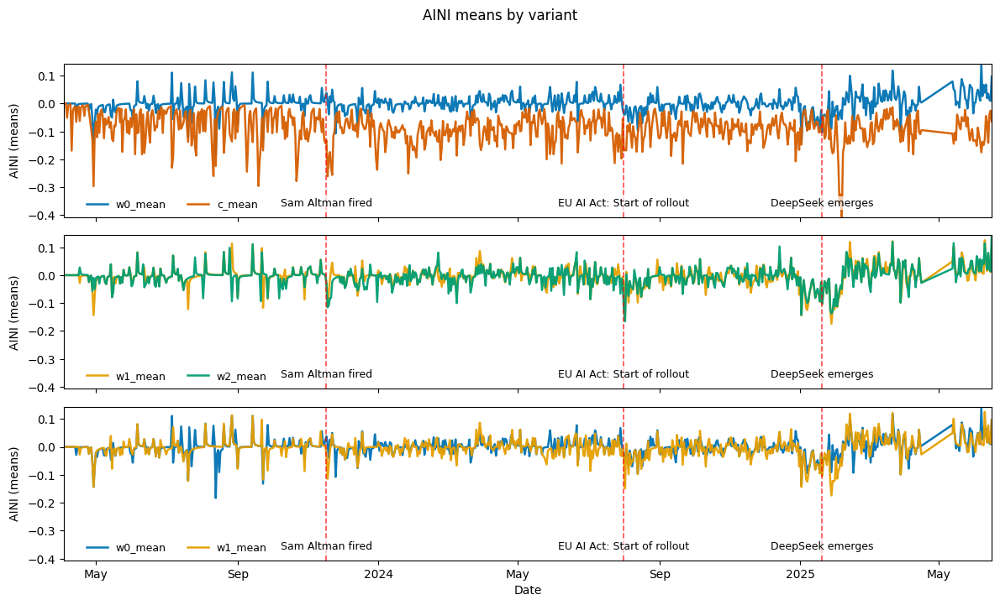

# AI Narrative Index (AINI)

This repository documents the complete research pipeline for constructing the **AI Narrative Index (AINI)** — a time series measuring how Artificial Intelligence (AI) is represented in financial news.  

The index values are based on articles from the **Wall Street Journal (WSJ)** (2023–2025) and are used as explanatory variables for predicting stock returns.  

The project integrates **Transformer-based NLP methods**, **manual annotation**, **deep learning fine-tuning**, and **statistical inference** — following a modular and reproducible architecture.  

The flowchart below illustrates the entire process.*  


*The process is shown in English since the entire thesis is written in English.

---

## Research Objectives

- **Development of multiple variants of the AI Narrative Index (AINI)** using Transformer models  
- **Quantification of narrative hype effects** on market dynamics via Granger causality  
- **Ensuring scientific validity** through double-coding annotation, diagnostic tests, and resampling-based inference  

---

## Construction of the AINI

The measurement combines **human annotation, Transformer models, and lexicon-based methods**.

### 1. Manual Annotation & FinBERT Fine-Tuning

- Creation of a manually annotated dataset with **independent double annotation** and subsequent verification (double-blind).  
- Annotation of **AI relevance** (binary classification).  

- Fine-tuning of a **FinBERT model** using:  
  - A class-weighted loss function to **address class imbalance**  
  - Extraction around **context windows**  
  - **Early stopping** and detailed evaluation logging  

- The model identifies AI-related narratives in WSJ articles.  
- A subsequent **sentiment analysis** (with [ProsusAI/finbert](https://huggingface.co/ProsusAI/finbert)) is conducted.  
- The resulting sentiment outputs are **further processed** (normalization, aggregation, exponential smoothing) and condensed into a **daily AINI time series**.  

---

### 2. Lexicon-Based Snippet Reduction

- **Identification** of AI-related articles via **keyword lists**  
- Application of **FinBERT** on extracted **text snippets** around various **context windows**  
- Sentiment outputs are likewise **normalized, aggregated, and smoothed**, then transformed into **daily AINI time series**  

---

## Statistical Inference

To analyze the interactions between narratives and financial markets, **econometric methods** are applied.

### Stationarity Tests
- Augmented Dickey-Fuller (ADF)  
- Phillips-Perron (PP)  
- KPSS  

All variables are tested for stationarity prior to modeling.  

### Granger Causality (GC)

Granger causality between AINI and financial variables is tested using:

- **Wild Residual Bootstrap** (10,000 resamples, Rademacher weights) → robust empirical p-values  
- **Benjamini–Hochberg correction** for controlling false discovery rate in multiple tests  

Regression specification (with VIX growth rate as a control for market risk*):  

  


*Additional control variables: number of daily articles, market index (S&P 500), and semiconductor index (SOX).  

---

## Selected Results

The first chart illustrates the AI Narrative Index (AINI) in different variants, where **prefixes indicate the size** of the applied **context window**.  
**Variant C** is based on the **full article** (title + main text) and uses the maximum possible input of 512 tokens.  
The displayed **series** represent the **mean of all variables** (see formula) within each context window.  



The next chart shows the estimated regression coefficients of the different AINI variables for the respective stocks & ETFs.  
Significance is independently confirmed by both methods — analytic tests as well as bootstrap inference with FDR correction.  

  

**Preliminary conclusions:**  
- Context window size correlates with the negativity of the AINI.  
- For w=0, 1 & 2, the indices peak at partly predictable points in time.  
- For highly AI-exposed companies (e.g., NVIDIA, Broadcom), **robust relationships** AINI → returns can be observed.  

---

## Project Structure

The implementation follows a **modular best-practice design**.  
All components are clearly separated (data acquisition, preprocessing, annotation, modeling, visualization), ensuring the pipeline can be executed reproducibly.  

```text
AI_narrative_index/
│
├── src/
│   ├── fetch_data/
│   │   ├── load_financial_data.py              # Download financial market data
│   │   ├── wsj_archive_crawler.py              # Crawl WSJ archive pages, collect URLs
│   │   └── wsj_archive_scraper.py              # Download full article contents
│   │
│   ├── preprocessing/
│   │   ├── clean_database.py                   # Filter articles by section, length, duplicates
│   │   ├── corpus_cleaning.py                  # Remove UI/meta elements from text
│   │   ├── reduce_db_for_sentiment.py          # Extract subset for sentiment analysis
│   │   ├── combine_article_dbs.py              # Merge yearly DBs into one CSV
│   │   ├── section_filtering.py                # Remove irrelevant WSJ sections
│   │   └── simple_ai_filter.py                 # Mark articles with AI keywords
│   │
│   ├── annotation/
│   │   ├── comparing_annotations.py            # Resolve annotator conflicts
│   │   └── label_articles.py                   # Interactive annotation tool (AI/Hype)
│   │
│   ├── modelling/
│   │   ├── ai_windows.py                       # Extract contextual snippets around AI terms
│   │   ├── calculate_summary_statistics.py     # Descriptive stats for AINI
│   │   ├── compute_extrema.py                  # Extremes (Min/Max) of AINI variants
│   │   ├── construct_AINI_variables.py         # Build AINI time series (normalization, EMAs)
│   │   ├── CustomFinBERT.py                    # Custom FinBERT with dropout & class weights
│   │   ├── stationarity_testing.py             # Stationarity tests (ADF, PP)
│   │   ├── estimate_granger_causality.py       # Granger causality with bootstrap
│   │   ├── predict_binary_AINI_FinBERT.py      # AI vs. Non-AI classification
│   │   └── predict_AINI_FinBERT_window.py      # Context-based sentiment inference
│   │
│   ├── visualizations/
│   │   ├── construct_latex_tables.py           # Automated LaTeX tables
│   │   └── plot_granger_causality.py           # Visualize GC results
│   │
│   ├── databases/
│   │   ├── fix_article_ids_in_db.py            # Ensure unique article_id
│   │   └── create_database.py                  # Create SQL DB structure
│   │
│   ├── scripts/                                # CLI wrappers for reproducibility
│   │   ├── run_create_database.py
│   │   ├── run_wsj_scraper.py
│   │   ├── run_clean_database.py
│   │   ├── run_reduce_db_for_sentiment.py
│   │   ├── run_predict_investor_sentiment.py
│   │   ├── run_predict_binary_AINI_FinBERT.py
│   │   ├── run_predict_AINI_FinBERT_window.py
│   │   │── run_combine_article_dbs.py
│   │   │── run_fix_article_ids.py
│   │   │── run_estimate_granger_causality.py
│   │   │── run_estimate_OLS.py
│   │   │── run_naive_labeling.py
│   │   └── run_construct_AINI_variables.py
│
├── notebooks/
│   ├── analyse_gc_results.ipynb
│   ├── benchmark_windows.ipynb
│   ├── compare_annotations.ipynb
│   ├── compare_class_variants.ipynb
│   ├── exploratory_analysis_aini.ipynb
│   ├── exploratory_analysis_labels.ipynb
│   ├── exploratory_analysis_raw_res.ipynb
│   ├── exploratory_analysis_wsj.ipynb
│   ├── label_manually.ipynb
│   ├── sample_articles.ipynb
│   ├── subset_for_latex.ipynb
│   ├── subset_VIX.ipynb
│   ├── train_FinBERT_annot.ipynb
│   └── visualize_aini_variables.ipynb
│
├── data/
│   ├── raw/                                   # Raw data (articles, financials)
│   ├── interim/                               # Intermediate data (annotation, subsets)
│   └── processed/
│       ├── variables/                         # Final variables (AINI, GC, TE etc.)
│       └── articles/                          # Cleaned article texts
│
└── models/                                    # Fine-tuned FinBERT & sentiment models


# Data Catalog

This catalog documents the datasets used and generated in the **AI Narrative Index (AINI)** project.  
The structure follows **MLOps best practices**:

- **Traceability:** every dataset is linked to its generating script  
- **Reproducibility:** the raw → interim → processed pipeline is fully transparent  
- **Versioning:** placeholders `{year}` / `{vers}` separate time ranges and versions  
- **Auditability:** all transformations are fully documented  

---

## 📂 `data/raw/`

Immutable raw data after collection.  
Single source of truth for all downstream steps.  

### 📂 `articles/`

| File | Description | Origin |
|------|-------------|--------|
| `articlesWSJ_{year}.db` | WSJ raw databases with `articles` and `articles_index` | Created via `create_database.py`, filled by `wsj_archive_scraper.py` & `wsj_archive_crawler.py` |

### 📂 `financial/`

All files contain OHLCV data: `Date`, `Ticker`, `Open`, `High`, `Low`, `Close`, `Adj Close`, `Volume`.  
Generated with `load_financial_data.py`.  

| File | Description |
|------|-------------|
| `{TICKER}_full_2023_2025.csv` | Daily OHLCV for individual tickers (e.g., `AAPL`, `NVDA`, `MSFT`) |
| `full_daily_2023_2025.csv` | Aggregated OHLCV data for all tickers |

---

## 📂 `data/interim/`

Storage for experiments, human-in-the-loop tasks, and partially processed data.  
Used for **annotation, sampling, and benchmarks**.  

### Sampling & Annotation

| File | Description | Origin |
|------|-------------|--------|
| `articles_WSJ_batch_{1–4}.csv` | Random samples for annotation | `sample_articles.ipynb` |
| `articles_WSJ_sub500.csv` | Initial 500-article subset (basis for batches) | `sample_articles.ipynb` |
| `articles_WSJ_batch_{n}_annotator.csv` | Labels from professional annotator | External → Import |
| `articles_WSJ_batch_{n}_author.csv` | Author’s labels | `label_manually.ipynb` |
| `*_subsample_author.csv` | 25% author subsample | Manual selection |

---

## 📂 `data/processed/`

Canonical datasets for **training, evaluation, and analysis**.  
Noise and disagreements are resolved.  

### 📂 `articles/`

| File | Description | Origin |
|------|-------------|--------|
| `articlesWSJ_clean_{year}.db` | Cleaned WSJ articles (noise removed) | `clean_database.py` (patterns from `corpus_cleaning.py`) |
| `annotated_subsample_WSJ_final.csv` | Consensus labels after conflict resolution | `compare_annotations.ipynb` |
| `articles_WSJ_batch_{n}_final.csv` | Final agreed batch labels | `compare_annotations.ipynb` |

---

## 📂 `variables/`

Model outputs, diagnostics, and statistical results.  
All **results are reproducible from code**.  

| File | Description | Origin |
|------|-------------|--------|
| `w0_AINI_variables.csv`, `w1_AINI_variables.csv`, `w2_AINI_variables.csv`, `binary_AINI_variables.csv` | AINI variables (normalized + EMA α=0.2/0.8) | `construct_AINI_variables.py` |
| `FinBERT_AINI_prediction_{year}_windowsize_{n}.csv` | Context window predictions (−1, 0, 1) | `predict_AINI_FinBERT_window.py` |
| `FinBERT_binary_prediction_{year}.csv` | Binary FinBERT predictions on pre-labeled data | `predict_AINI_FinBERT_prelabeled_fin.py` |
| `granger_causality_{spec}.csv` | GC results (AINI ↔ returns) with 10k bootstrap + FDR | `estimate_granger_causality.py` |
| `ols_sameday_mbboot_fdr_{spec}.csv` | Contemporaneous OLS effects | `estimate_OLS.py` |
| `diagnostics_{spec}.csv` | OLS residual diagnostics (Ljung-Box, BG, ARCH-LM, …) | `ols_residual_diagnostics.py` |
| `combined_te_results_window_1.csv` | Transfer Entropy results | `calc_entropy.py` |
| `extrema.csv` | Min/Max of AINI variables | `exploratory_analysis_aini.ipynb` |
| `{vers}_AINI_variables.csv` | AINI measures (normalized + EMA, relative) | `run_construct_AINI_variables.py` |
| `naive_AI_labels_{year}.csv` | Dictionary-based AI relevance labels | `label_articles.py` (`naive_labeling`) |
| `n_articles.csv` | Number of articles per day | `exploratory_analysis_aini.ipynb` |

---

## Note

The scraped contents are used exclusively for academic research and are **not** shared publicly for copyright reasons.  
The trained models can be shared upon request (depending on size and usage context).  
