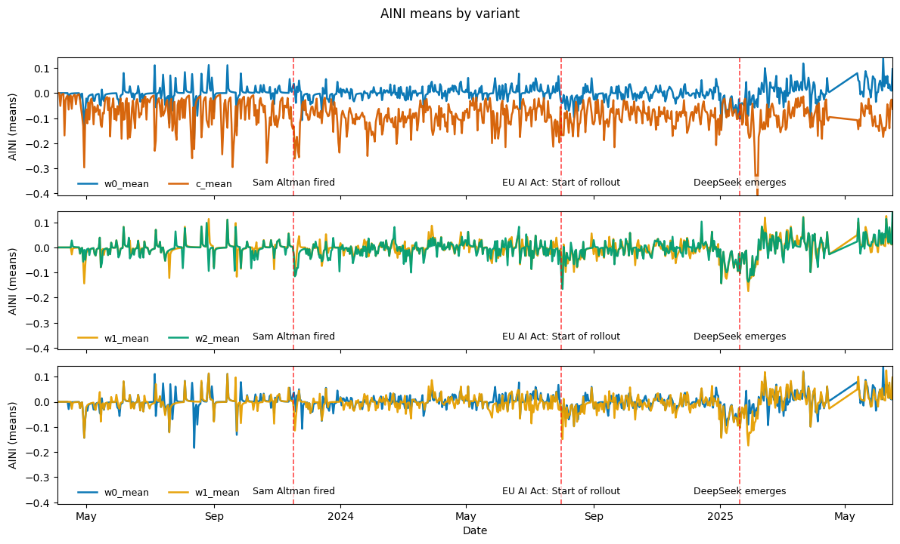
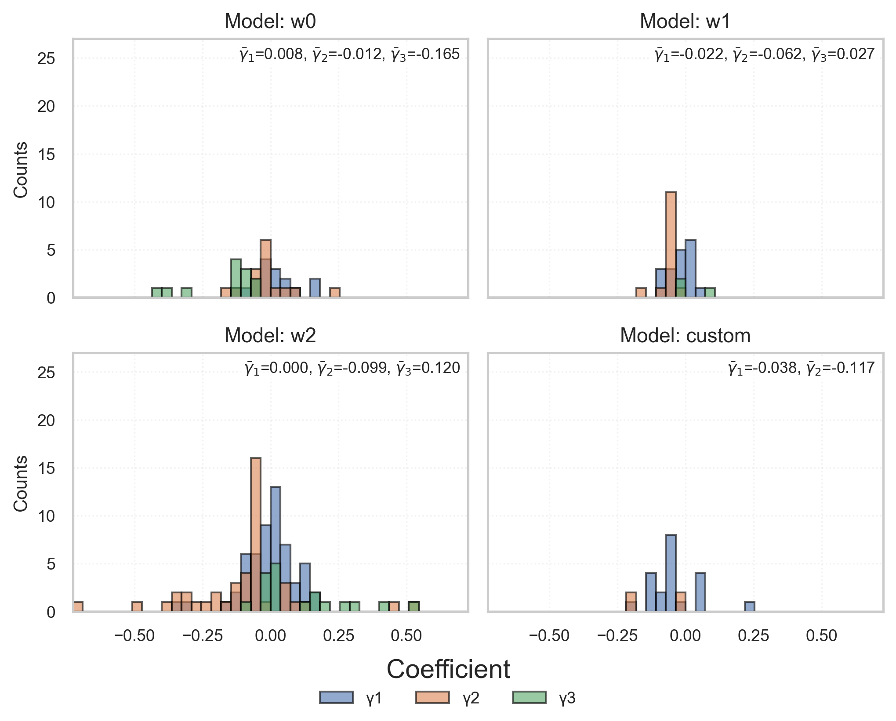

# AI Narrative Index (AINI)

**English version:** [here](https://github.com/LarsIX/narrative_index/blob/main/README%20-%20English.md)
**Finale Thesis:** [here](https://github.com/LarsIX/narrative_index/blob/main/README%20-%20English.md)
---

## Überblick

Dieses Repository dokumentiert die vollständige Forschungs- und Implementierungspipeline zur Konstruktion des **AI Narrative Index (AINI)** — einer Zeitreihe, die misst, wie Künstliche Intelligenz (KI) in Finanznachrichten dargestellt wird.  
Nach aktuellem Kenntnisstand handelt es sich um den **ersten technologiespezifischen Hype-Index**, der narrative Aufmerksamkeit und Sentiment gegenüber KI quantitativ erfasst.

Das Projekt kombiniert **Transformer-basierte Sprachmodelle**, **Deep Learning** und **ökonometrische Inferenz** in einer **modularen, reproduzierbaren Architektur**.


*Hinweis: Der Prozessablauf ist in englischer Sprache dargestellt, da die zugrunde liegende Arbeit vollständig auf Englisch verfasst wurde.*

---

## Forschungsziele

- Entwicklung mehrerer **Transformer-basierter Varianten** des AINI (verschiedene Kontextfenster und FinBERT-Finetuning)
- Quantifizierung narrativer **Hype-Effekte auf Finanzmärkte** mittels Granger-Kausalität
- Sicherstellung **wissenschaftlicher Validität** durch Doppelannotation, diagnostische Tests und resampling-basierte Inferenz

---

## Konstruktion des AINI

Der Index kombiniert **menschliche Annotation**, **feingetunte Sprachmodelle** und **lexikonbasierte Methoden**, um KI-bezogene Narrative in Finanztexten zu messen.

### 1. Manuelle Annotation & Feintuning von FinBERT

- Erstellung eines doppelt annotierten Datensatzes zur Identifikation von **KI-relevanten Artikeln**  
- Feintuning eines **FinBERT-Modells** auf dieser Basis zur binären Klassifikation („über KI“ / „nicht über KI“)  
- Anwendung des Modells auf Artikel des **Wall Street Journal (WSJ, 2023–2025)**  
- Durchführung einer **Sentimentanalyse** ([ProsusAI/finbert](https://huggingface.co/ProsusAI/finbert)) auf erkannte Narrative  
- Normalisierung, Aggregation und exponentielle Glättung der Ergebnisse zu einer **täglichen Zeitreihe**

### 2. Lexikonbasierte Snippet-Selektion

- Vorselektion KI-bezogener Absätze durch eine **regelbasierte Keywordsuche**
- Extraktion mehrerer **Kontextfenster** um geflaggte Schlüsselwörter
- Anwendung von FinBERT auf diese Snippets, anschließende **Aggregation und Glättung** zu Tageswerten
- Erstellung zusätzlicher AINI-Varianten zur Robustheitsanalyse

---

## Statistische Inferenz

Die Wechselwirkungen zwischen Narrativen und Finanzmarktvariablen werden mit **ökonometrischen Verfahren** untersucht.

### Stationaritätstests
- Augmented Dickey-Fuller (ADF)  
- Phillips-Perron (PP)  
- KPSS  

Alle Zeitreihen wurden auf Stationarität geprüft und bei Bedarf differenziert.

### Granger-Kausalität

Zur Analyse der Richtungseffekte zwischen AINI und Aktienrenditen wird Granger-Kausalität verwendet.  
Die Tests basieren auf:

- **Wild Residual Bootstrap** (10.000 Resamples mit Rademacher-Gewichten) → robuste empirische p-Werte  
- **Benjamini–Hochberg-Korrektur** zur Kontrolle der Fehlerquote bei multiplen Tests  

Beispielhafte Regressionsspezifikation:


Alle Modelle wurden auch in der **Gegenrichtung** (log. Rendite → AINI) geschätzt, um Rückkopplungseffekte zwischen Markt und Narrativen zu erfassen.

*Kontrollvariablen:* Wachstumsraten täglicher Artikelzahlen, S&P 500, SOX-Index.  
*Lag-Längen:* l = ρ ∈ {1, 2, 3}

---

## Ergebnisse (Auswahl)

### AI Narrative Index (AINI) – Variantenvergleich
Die Varianten unterscheiden sich in der Größe des verwendeten Kontextfensters:
w₀ nutzt ausschließlich den Satz mit einem KI-Schlüsselwort (keine Kontextintegration),
w₁ erweitert das Fenster bidirektional um einen Satz vor und nach dem Treffer,
w₂ umfasst zwei Sätze um den Treffer,
und custom verarbeitet den vollständigen Artikel (Titel + Haupttext, bis zu 512 Token).
Dadurch steigt mit wachsendem Kontextfenster die semantische Tiefe und narrative Kohärenz der erfassten Textpassagen.


### Signifikante Effekte nach Asset und Periode
Die nächste Abbildung zeigt signifikante Granger-Kausalitätsergebnisse (AINI → Renditen):


### Verteilung der Regressionskoeffizienten
Die Verteilung der γ-Koeffizienten zeigt die Streuung und Richtung der AINI-Effekte:



---

## Zentrale Befunde

**Modellverhalten**
- Größere Kontextfenster führen tendenziell zu negativeren Sentiments.
- Die FinBERT-Variante erzielt mit einem gewichteten Macro-F1-Score von **0.92** sehr gute Ergebnisse.
- Die lexikonbasierte Variante zeigt vergleichbare Klassifikationsleistung auf dem validierten Datensatz.

**Ökonomische Ergebnisse**
- Die AINI-Serien (w₀–w₂) sind 2025 nicht stationär → mögliches Regimewechsel-Signal.
- In Übereinstimmung mit der Effizienzmarkthypothese sind die meisten Regressionen insignifikant.
- Für signifikante Fälle erklärt der AINI nur einen kleinen Teil der Gesamtvarianz, erhöht jedoch kurzfristig die Renditevolatilität um das 5- bis 35-Fache.
- In der Gegenrichtung (Rendite → AINI) zeigen manche Assets eine starke narrative Reaktion (bis zu 85 % erklärte Variation).

**Limitationen**
- Beschränkt auf WSJ-Daten (2023–2025)
- Fokus auf wachstumsstarke Assets (z. B. NVIDIA)
- Begrenzter Zeitraum und Stichprobe
- Keine Modellierung nichtlinearer Effekte

---

```text
AI_narrative_index/
│
├── src/
│   ├── fetch_data/
│   │   ├── load_financial_data.py              # ETL-Modul zum Abruf und Preprocessing von Finanzmarktdaten (APIs, YahooFinance etc.)
│   │   ├── wsj_archive_crawler.py              # Web-Crawler für WSJ-Archivseiten (URL-Discovery pro Tag)
│   │   └── wsj_archive_scraper.py              # Scraper zum Extrahieren kompletter Artikeltexte (Content Harvesting)
│   │
│   ├── preprocessing/
│   │   ├── clean_database.py                   # Datenbereinigung: Filterung nach Rubriken, Textlänge, Duplikaten
│   │   ├── corpus_cleaning.py                  # Text-Normalisierung: Entfernt HTML-Artefakte, UI-Reste, Metadaten
│   │   ├── reduce_db_for_sentiment.py          # Sampling-Modul: Teilmenge für Sentiment-Labeling extrahieren
│   │   ├── combine_article_dbs.py              # Datenaggregation: Zusammenführen mehrerer SQLite-Jahre in ein zentrales CSV
│   │   ├── fix_article_ids.py                  # Datenintegrität: Sicherstellung eindeutiger Artikel-IDs
│   │   ├── section_filtering.py                # Relevanzfilterung: Entfernt irrelevante Themen-Sektionen
│   │   └── simple_ai_filter.py                 # Keyword-basierte Pre-Selektion KI-relevanter Artikel (Rule-based Tagging)
│   │
│   ├── annotation/
│   │   ├── comparing_annotations.py            # Inter-Annotator-Agreement & Konfliktauflösung
│   │   └── label_articles.py                   # Interaktive Annotation-UI (Labeling-Pipeline für AI/Hype-Kategorien)
│   │
│   ├── modelling/
│   │   ├── ai_windows.py                       # Context-Window-Generator: Snippet-Extraction um KI-Begriffe
│   │   ├── calculate_summary_statistics.py     # Explorative Statistik & Feature-Diagnostics
│   │   ├── compute_extrema.py                  # Ermittlung lokaler Extremwerte der AINI-Features
│   │   ├── construct_AINI_variables.py         # Feature-Engineering: Konstruktion & Normalisierung der AINI-Zeitreihen
│   │   ├── CustomFinBERT.py                    # Angepasstes FinBERT-Modell mit Class-Weights, Dropout & Layer-Freezing
│   │   ├── stationarity_testing.py             # Zeitreihen-Diagnostik: Stationaritätstests (ADF, PP)
│   │   ├── estimate_granger_causality.py       # Kausalinferenz-Pipeline mit Bootstrap-Granger-Tests
│   │   ├── estimate_transfer_entropy.py        # Legacy-Modul: KSG-basierte Transfer-Entropie-Schätzung
│   │   ├── format_te_gc_inputs.py              # Daten-Preprocessing für TE/GC-Module (Lag-Alignment, Normalisierung)
│   │   ├── predict_binary_AINI_FinBERT.py      # Inferenz: Klassifikation „AI vs. Non-AI“ mit FinBERT
│   │   └── predict_AINI_FinBERT_window.py      # Kontextsensitive Sentiment-Inference (window-basiert)
│   │
│   ├── visualizations/
│   │   ├── construct_tables.py                 # Tabellarisches Reporting (LaTeX-Export der GC-Resultate)
│   │   ├── plot_functions.py                   # Generische Plot-Utilities für Zeitreihen & Sentiment-Verläufe
│   │   ├── plot_granger_causality.py           # Visualisierung von Regressions- und GC-Ergebnissen
│   │   ├── prepare_PPT.py                      # Automatisierte Erstellung von PowerPoint-Slides für Ergebnispräsentationen
│   │   ├── read_articles.py                    # Artikel-Visualisierung / Content-Inspection
│   │   └── stationarity_report.py              # Automatisierter Report zu ADF-, PP- und KPSS-Tests
│   │
│   ├── databases/
│   │   └── create_database.py                  # Datenbank-Schema-Definition (SQLite-Setup & Table-Creation)
│   │
│
├── scripts/                                    # CLI-Wrappers für reproduzierbare Pipelines (Command-Line Interface)
│   ├── __init__.py
│   ├── estimate_collider_granger_causality.py  # Erweiterter GC-Test mit Collider-Kontrolle
│   ├── init_jvm.py                             # Initialisierung von Java-Umgebungen für IDTxl (TE)
│   ├── run_clean_database.py                   # Führt Bereinigungs-Pipeline aus
│   ├── run_combine_article_dbs.py              # Kombiniert Artikel-Datenbanken
│   ├── run_construct_AINI_variables.py         # Baut finale AINI-Features & Zeitreihen
│   ├── run_create_database.py                  # Erstellt DB-Schema & Tabellen
│   ├── run_estimate_granger_causality.py       # Startet Granger-Causality-Analyse
│   ├── run_estimate_ols.py                     # Führt OLS-Regressionen aus
│   ├── run_fix_article_ids.py                  # Repariert doppelte IDs in Datenbanken
│   ├── run_load_financial_data.py              # Lädt & speichert Finanzzeitreihen (Batch-Mode)
│   ├── run_naive_labeling.py                   # Heuristische Labeling-Baseline (Rule-based)
│   ├── run_predict_AINI_FinBERT_prelabeled_fin.py  # Finetuned FinBERT-Inference auf vorannotierten Daten
│   ├── run_predict_AINI_FinBERT_window.py      # Batch-Inference der window-basierten AINI-Modelle
│   ├── run_predict_binary_AINI_FinBERT.py      # Klassifikations-Pipeline AI/Non-AI
│   ├── run_predict_investor_sentiment.py       # Sentiment-Inference für Investorenstimmung
│   ├── run_reduce_db_for_sentiment.py          # Reduziert Datenbank auf Sentiment-Relevantes Subset
│   ├── run_stationarity_testing.py             # Führt ADF/PP/KPSS-Tests automatisiert aus
│   ├── run_wsj_crawler.py                      # Crawlt WSJ-Archivseiten
│   └── run_wsj_scraper.py                      # Extrahiert Artikelinhalte (nach Crawl)
│ 
├── notebooks/
│   ├── analyse_gc_results.ipynb               # Analyse & Visualisierung der Granger-Causality-Resultate
│   ├── benchmark_windows.ipynb                # Vergleich unterschiedlicher Kontext-Fensterstrategien
│   ├── calc_CAPM.ipynb                        # Durchführung von CAPM-Regressionen (Asset Pricing)
│   ├── compare_annotations.ipynb              # Evaluation der Label-Konsistenz zwischen Annotatoren
│   ├── compare_class_variants.ipynb           # Vergleich verschiedener Modell-Konfigurationen 
│   ├── exploratory_analysis_aini.ipynb        # Explorative Analyse der AINI-Zeitreihen
│   ├── exploratory_custom_fin.ipynb           # Analyse der Fine-Tuning-Resultate von FinBERT
│   ├── exploratory_analysis_raw_res.ipynb     # Analyse der Roh-Annotationsergebnisse
│   ├── exploratory_analysis_wsj.ipynb         # Datenexploration: WSJ-Korpus
│   ├── label_manually.ipynb                   # Manuelle Annotation von Artikeln (Human-in-the-Loop)
│   ├── sample_articles.ipynb                  # Sampling & Randomisierung für Annotationen
│   ├── stationarity_evaluation.ipynb          # Diagnostik zu Stationarität & Lag-Strukturen
│   ├── subset_for_latex.ipynb                 # Aufbereitung für LaTeX-Reporting (Legacy)
│   ├── train_FinBERT_annot.ipynb              # Fine-Tuning-Pipeline für FinBERT
│   └── visualize_aini_variables.ipynb         # Explorative Visualisierung der AINI-Features (Legacy)
│
├── data/
│   ├── raw/                                   # Rohdaten (Artikel, Kurszeitreihen, externe Indizes)
│   ├── interim/                               # Zwischenschritte (annotierte Samples, Preprocessed Corpora)
│   └── processed/
│       ├── variables/                         # Finalisierte Features & Ergebnis-Variablen (AINI, GC, TE)
│       └── articles/                          # Bereinigte Artikeldaten (Text-Corpus für Inferenz)
│
└── models/                                    # Trainierte Modelle & Weights (FinBERT-Checkpoints, Tokenize Configs)

```

# Datenkatalog

Dieser Katalog dokumentiert die im Projekt **AI Narrative Index (AINI)** verwendeten und erzeugten Datensätze.  
Die Struktur folgt **MLOps-Best Practices**:
- **Nachvollziehbarkeit (Traceability):** jeder Datensatz ist seinem erzeugenden Skript zugeordnet.
- **Reproduzierbarkeit:** die Pipeline raw → interim → processed ist transparent dokumentiert.
- **Versionierung:** Platzhalter `{year}` bzw. `{vers}` trennen Zeiträume/Versionen sauber.
- **Auditierbarkeit:** die Herkunft sämtlicher Transformationen ist festgehalten.

---

## 📂 `data/raw/`

Rohdaten, nach Erhebung unveränderlich.  
Single Source of Truth für alle nachgelagerten Schritte.

### 📂 `articles/`

| Datei | Beschreibung | Herkunft |
|------|--------------|----------|
| `articlesWSJ_{year}.db` | WSJ-Rohdatenbanken mit `articles` und `articles_index` | Erstellt via `create_database.py`, befüllt durch `wsj_archive_scraper.py` & `wsj_archive_crawler.py` |

### 📂 `financial/`

Alle Dateien enthalten OHLCV-Daten: `Date`, `Ticker`, `Open`, `High`, `Low`, `Close`, `Adj Close`, `Volume`.  
Erzeugt mit `load_financial_data.py`.

| Datei | Beschreibung |
|------|--------------|
| `{TICKER}_full_2023_2025.csv` | Tägliche OHLCV für Einzelticker (z. B. `AAPL`, `NVDA`, `MSFT`) |
| `full_daily_2023_2025.csv` | Aggregierte OHLCV-Daten für alle Ticker |

---

## 📂 `data/interim/`

Ablage für Experimente, Human-in-the-Loop-Aufgaben und teilweise verarbeitete Daten.  
Genutzt für **Annotation, Sampling und Benchmarks**.

### Sampling & Annotation

| Datei | Beschreibung | Herkunft |
|------|--------------|----------|
| `articles_WSJ_batch_{1–4}.csv` | Zufallsstichproben für Annotation | `sample_articles.ipynb` |
| `articles_WSJ_sub500.csv` | Initiales 500-Artikel-Subset (Basis für Batches) | `sample_articles.ipynb` |
| `articles_WSJ_batch_{n}_annotator.csv` | Labels der professionellen Annotatorin / des Annotators | Extern → Import |
| `articles_WSJ_batch_{n}_author.csv` | Autor*innen-Labels | `label_manually.ipynb` |
| `*_subsample_author.csv` | 25 % Autor*innen-Subsample | Manuelle Auswahl |

---

## 📂 `data/processed/`

Kanonische Datensätze für **Training, Evaluation und Auswertung**.  
Zwischenstände (Rauschen, Uneinigkeit) sind bereinigt.

### 📂 `articles/`

| Datei | Beschreibung | Herkunft |
|------|--------------|----------|
| `articlesWSJ_clean_{year}.db` | Bereinigte WSJ-Artikel (Störmuster entfernt) | `clean_database.py` (Muster aus `corpus_cleaning.py`) |
| `annotated_subsample_WSJ_final.csv` | Konsensus-Labels nach Konfliktlösung | `compare_annotations.ipynb` |
| `articles_WSJ_batch_{n}_final.csv` | Final abgestimmte Batch-Labels | `compare_annotations.ipynb` |

---

## 📂 `variables/`

Modellausgaben, Diagnostik und statistische Ergebnisse.  
Alle **Ergebnisse sind aus dem Code reproduzierbar**.

| Datei | Beschreibung | Herkunft |
|------|--------------|----------|
| `w0_AINI_variables.csv`, `w1_AINI_variables.csv`, `w2_AINI_variables.csv`, `binary_AINI_variables.csv` | AINI-Variablen (normalisiert + EMA α=0.2/0.8) | `construct_AINI_variables.py` |
| `FinBERT_AINI_prediction_{year}_windowsize_{n}.csv` | Kontextfenster-Vorhersagen (−1, 0, 1) | `predict_AINI_FinBERT_window.py` |
| `FinBERT_binary_prediction_{year}.csv` | Binäre FinBERT-Vorhersagen auf vorlabelten Daten | `predict_AINI_FinBERT_prelabeled_fin.py` |
| `granger_causality_{spec}.csv` | GC-Ergebnisse (AINI ↔ Renditen) mit 10k Bootstrap + FDR | `estimate_granger_causality.py` |
| `ols_sameday_mbboot_fdr_{spec}.csv` | Zeitgleiche OLS-Effekte | `estimate_OLS.py` |
| `diagnostics_{spec}.csv` | OLS-Residualdiagnostik (Ljung-Box, BG, ARCH-LM, …) | `ols_residual_diagnostics.py` |
| `combined_te_results_window_1.csv` | Transfer-Entropy-Ergebnisse | `calc_entropy.py` |
| `extrema.csv` | Minima/Maxima der AINI-Variablen | `exploratory_analysis_aini.ipynb` |
| `{vers}_AINI_variables.csv` | AINI-Maße (normalisiert + EMA, relativ) | `run_construct_AINI_variables.py` |
| `extrema.csv` | Min/Max nach Maßanzahl | `exploratory_analysis_results.ipynb` |
| `naive_AI_labels_{year}.csv` | Wörterbuchbasierte AI-Relevanz-Labels | `label_articles.py` (`naive_labeling`) |
| `n_articles.csv` | Artikelanzahl pro Tag | `exploratory_analysis_aini.ipynb` |

---

### Hinweis

Die gescrapten Inhalte werden ausschließlich zu akademischen Forschungszwecken verwendet und aus urheberrechtlichen Gründen **nicht** öffentlich geteilt.  
Die trainierten Modelle können auf Anfrage geteilt werden (abhängig von Größe und Nutzungskontext).

---

## Autor & Kontext

Dieses Repository bildet die empirische Grundlage einer Masterarbeit in Volkswirtschaftslehre und verbindet:

- **Behavioral Finance & Effizienzmarkthypothese**
- **NLP und Deep Learning (Transformer)**
- **Ökonometrische Inferenz**

---

## Kontakt

- 📧 `lars.augustat@icloud.com`  
- 🌐 [LinkedIn-Profil](https://www.linkedin.com/in/lars-augustat/)
