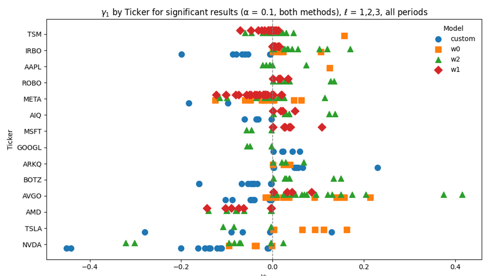

# AI Narrative Index (AINI)

Dieses Repository dokumentiert die vollständige Forschungspipeline zur Konstruktion des **AI Narrative Index (AINI)** — einer Zeitreihe, die misst, wie Künstliche Intelligenz (KI) in Finanznachrichten dargestellt wird.  

Die Indexwerte basieren auf Artikeln des **Wall Street Journal (WSJ)** (Zeitraum 2023–2025) und werden als erklärende Variablen zur Prognose von Aktienrenditen eingesetzt.  

Das Projekt integriert **Transformer-basierte NLP-Methoden**, **manuelle Annotation**, **Deep-Learning-Finetuning** sowie **statistische Inferenz** — und folgt dabei einer modularen, reproduzierbaren Architektur.  

Das folgende Flussdiagramm veranschaulicht den gesamten Prozess.*


*Der Prozessablauf ist in englischer Sprache wiedergegeben, da die gesamte Arbeit in Englisch verfasst wird.

---

## Forschungsziele

- **Entwicklung mehrerer Varianten des AI Narrative Index (AINI)** mittels Transformer-Modellen  
- **Quantifizierung narrativer Hype-Effekte** auf Marktdynamiken anhand von Granger-Kausalität  
- **Sicherung wissenschaftlicher Validität** durch Annotation mit Doppel-Codierung, diagnostische Tests und resampling-basierter Inferenz  

---

## Konstruktion des AINI

Die Messung erfolgt durch die Kombination von **menschlicher Annotation, Transformer-Modellen und lexikonbasierten Methoden**.

### 1. Manuelle Annotation & Finetuning von FinBERT

- Erstellung eines manuell annotierten Datensatzes mit **unabhängiger Doppelannotation** und anschließender Verifikation (double-blind).
- Annotation nach **AI-Relevanz** (binäre Klassifikation)  

- Finetuning eines **FinBERT-Modells** unter Verwendung von:  
  - Einsatz einer klassen­gewichteten Verlustfunktion zum **Ausgleich von Klassenungleichgewichten**.  
  - Extraktion rund um **Kontextfenster**  
  - **Early Stopping** und detailliertem Evaluations-Logging  

- Das Modell identifiziert KI-bezogene Narrative in WSJ-Artikeln.  
- Im Anschluss wird eine **Sentimentanalyse** (mit [ProsusAI/finbert](https://huggingface.co/ProsusAI/finbert)) durchgeführt.  
- Die resultierenden Sentimentausgaben werden **weiterverarbeitet** (Normalisierung, Aggregation, exponentielle Glättung) und zu einer **täglichen AINI-Zeitreihe** verdichtet.  

---

### 2. Lexikon-gestützte Snippet-Reduktion

- **Identifikation** KI-relevanter Artikel durch **Schlüsselwortlisten**.  
- Anwendung von **FinBERT** auf extrahierte **Textausschnitte** rund um verschiedene **Kontextfenster**.  
- Die resultierenden Sentimentausgaben werden ebenfalls **normalisiert, aggregiert und geglättet** und in **tägliche AINI-Zeitreihen** überführt.  

---

## Statistische Inferenz

Zur Analyse der Wechselwirkungen zwischen Narrativen und Finanzmärkten werden **ökonometrische Verfahren** eingesetzt.

### Stationaritätstests
- Augmented Dickey-Fuller (ADF)  
- Phillips-Perron (PP)  
- KPSS  

Alle Variablen werden vor der Modellierung auf Stationarität geprüft.  

### Granger-Kausalität (GC)

Die Granger Kausalität zwischen AINI und Finanzvariablen wird getestet mittels:

- **Wild Residual Bootstrap** (10.000 Resamples, Rademacher-Gewichte) → robuste empirische p-Werte  
- **Benjamini–Hochberg-Korrektur** zur Kontrolle der Fehlerquote bei multiplen Tests  

Regressionsspezifikation (mit VIX-Wachstumsrate als Kontrollvariable für Marktrisiko*):

  


*Weitere Kontrollvariablen: Anzahl der täglichen Artikel, Marktindex (S&P 500) & Index für Halbleiter (SOX).

---

## Ergebnisse (Auswahl)

- Für stark KI-exponierte Unternehmen (z. B. NVIDIA, Broadcom) zeigen sich **robuste Zusammenhänge** AINI → Renditen.  
- Die Signifikanz ist sowohl nach **analytischen Verfahren (HC3)** als auch nach **Bootstrap-Inferenz mit FDR-Korrektur** nachweisbar.  

  

---

# Projektstruktur

Die Implementierung folgt einem **modularen Aufbau nach Best Practices**.  
Alle Komponenten sind klar getrennt (Datenakquise, Vorverarbeitung, Annotation, Modellierung, Visualisierung), sodass die Pipeline reproduzierbar ausgeführt werden kann.

```text
AI_narrative_index/
│
├── src/
│   ├── fetch_data/
│   │   ├── load_financial_data.py              # Download von Finanzmarktdaten
│   │   ├── wsj_archive_crawler.py              # Crawlt WSJ-Archivseiten, sammelt Artikel-URLs
│   │   └── wsj_archive_scraper.py              # Lädt vollständige Artikelinhalte von den URLs
│   │
│   ├── preprocessing/
│   │   ├── clean_database.py                   # Filtert Artikel nach Sektionen, Länge, Duplikaten
│   │   ├── corpus_cleaning.py                  # Entfernt UI-/Meta-Elemente aus Artikeltexten
│   │   ├── reduce_db_for_sentiment.py          # Extrahiert Subset für Sentimentanalyse
│   │   ├── combine_article_dbs.py              # Verknüpft Jahresdatenbanken zu einer CSV
│   │   ├── section_filtering.py                # Entfernt irrelevante WSJ-Sektionen
│   │   └── simple_ai_filter.py                 # Markiert Artikel mit KI-Schlüsselwörtern
│   │
│   ├── annotation/
│   │   ├── comparing_annotations.py            # Löst Konflikte zwischen Annotatoren
│   │   └── label_articles.py                   # Interaktives Tool für Annotation von AI/Hype
│   │  
│   │
│   ├── modelling/
│   │   ├── ai_windows.py                       # Kontextuelle Snippets um KI-Begriffe extrahieren
│   │   ├── calculate_summary_statistics.py     # Berechnet deskriptive Statistiken zu AINI
│   │   ├── compute_extrema.py                  # Extremwerte (Min/Max) der AINI-Varianten
│   │   ├── construct_AINI_variables.py         # Baut AINI-Zeitreihe (Normierung, EMAs)
│   │   ├── CustomFinBERT.py                    # Custom-FinBERT mit Dropout & Class Weights
│   │   ├── stationarity_testing.py             # Stationaritätstests (ADF, PP)
│   │   ├── estimate_granger_causality.py       # Granger-Kausalität mit Bootstrap-Verfahren
│   │   ├── predict_binary_AINI_FinBERT.py      # Klassifikation AI vs. Non-AI via Custom-FinBERT
│   │   └── predict_AINI_FinBERT_window.py      # Kontextbasierte inferenz von Sentiments
│   │
│   ├── visualizations/
│   │   ├── construct_latex_tables.py           # Automatisierte LaTeX-Tabellen für Thesis
│   │   └── plot_granger_causality.py           # Visualisierung der GC-Ergebnisse
│   │
│   ├── databases/
│   │   ├── fix_article_ids_in_db.py            # Stellt eindeutige article_id sicher
│   │   └── create_database.py                  # Erstellt SQL-Datenbankstruktur
│   │
│   ├── scripts/                                # CLI-Wrapper für reproduzierbare Ausführung
│   │   ├── run_create_database.py              # Initialisiert Datenbankschema
│   │   ├── run_wsj_scraper.py                  # Startet Crawler + Scraper
│   │   ├── run_clean_database.py               # Bereinigt Artikeldatenbank
│   │   ├── run_reduce_db_for_sentiment.py      # Reduziert DB für Sentiment-Analysen
│   │   ├── run_predict_investor_sentiment.py   # Sentiment-Prediction mit Standard-FinBERT
│   │   ├── run_predict_binary_AINI_FinBERT.py  # Binary-Klassifikation AI-Narrative
│   │   ├── run_predict_AINI_FinBERT_window.py  # Klassifikation mit Kontextfenstern
│   │   │── run_combine_article_dbs.py          # Verknüpft WSJ-Datenbanken (mehrere Jahre)
│   │   │── run_fix_article_ids.py              # Stellt eindeutige IDs sicher
│   │   │── run_estimate_granger_causality.py   # Schätzt Granger-Kausalität
│   │   │── run_estimate_OLS.py                 # OLS-Schätzung (Kontemporane Effekte)
│   │   │── run_naive_labeling.py               # Naive KI-Labels via Keywords
│   │   └── run_construct_AINI_variables.py     # Baut finale AINI-Variablen
│
├── notebooks/
│       ├── analyse_gc_results.ipynb           # Analyse von Regressionsergebnissen
│       ├── benchmark_windows.ipynb            # Vergleicht Kontextfenster
│       ├── compare_annotations.ipynb          # Konfliktlösung Annotationen
│       ├── compare_class_variants.ipnyb       # Vergleicht Klassifikationsschemata 
│       ├── exploratory_analysis_aini.ipynb    # Analyse AINI-Varianten
│       ├── exploratory_analysis_labels.ipynb  # Analyse AI-Labels v. custom FinBERT
│       ├── exploratory_analysis_raw_res.ipynb # Analyse unverarbeitete Sentimentzeitreihen
│       ├── exploratory_analysis_wsj.ipynb     # Analyse WSJ-Korpus 
│       ├── label_manually.ipynb               # Annotation durch den Author
│       ├── sameple_articles.ipynb             # Erstellung von Samples zur Annotation
│       ├── subset_for_latex.ipynb             # Konstruktion von Regressionstabellen Thesis
│       ├── subset_VIX.ipynb                   # Aufbereitung VIX-Zeitreihen
│       ├── train_FinBERT_annot.ipynb          # Fine-Tuning von FinBERT
│       └── visualize_aini_variables.ipynb     # AINI-Trends visualisieren
│       
│
├── data/
│   ├── raw/                                   # Rohdaten (Artikel, Finanzmarkt)
│   ├── interim/                               # Zwischendaten (Annotation, Subsets)
│   └── processed/
│       ├── variables/                         # Finale Variablen (AINI, GC, TE etc.)
│       └── articles/                          # Bereinigte Artikeltexte
│
└── models/                                    # Fine-Tuned FinBERT & Sentiment-Modelle

```

# Datenkatalog

Dieser Katalog dokumentiert die im Projekt **AI Narrative Index (AINI)** verwendeten und erzeugten Datensätze.  
Die Struktur folgt **MLOps-Best Practices**:
- **Nachvollziehbarkeit (Traceability):** jeder Datensatz ist seinem erzeugenden Skript zugeordnet.
- **Reproduzierbarkeit:** die Pipeline raw → interim → processed ist transparent dokumentiert.
- **Versionierung:** Platzhalter `{year}` bzw. `{vers}` trennen Zeiträume/Versionen sauber.
- **Auditierbarkeit:** die Herkunft sämtlicher Transformationen ist festgehalten.

---

## 📂 `data/raw/`

Rohdaten, nach Erhebung unveränderlich.  
Single Source of Truth für alle nachgelagerten Schritte.

### 📂 `articles/`

| Datei | Beschreibung | Herkunft |
|------|--------------|----------|
| `articlesWSJ_{year}.db` | WSJ-Rohdatenbanken mit `articles` und `articles_index` | Erstellt via `create_database.py`, befüllt durch `wsj_archive_scraper.py` & `wsj_archive_crawler.py` |

### 📂 `financial/`

Alle Dateien enthalten OHLCV-Daten: `Date`, `Ticker`, `Open`, `High`, `Low`, `Close`, `Adj Close`, `Volume`.  
Erzeugt mit `load_financial_data.py`.

| Datei | Beschreibung |
|------|--------------|
| `{TICKER}_full_2023_2025.csv` | Tägliche OHLCV für Einzelticker (z. B. `AAPL`, `NVDA`, `MSFT`) |
| `full_daily_2023_2025.csv` | Aggregierte OHLCV-Daten für alle Ticker |

---

## 📂 `data/interim/`

Ablage für Experimente, Human-in-the-Loop-Aufgaben und teilweise verarbeitete Daten.  
Genutzt für **Annotation, Sampling und Benchmarks**.

### Sampling & Annotation

| Datei | Beschreibung | Herkunft |
|------|--------------|----------|
| `articles_WSJ_batch_{1–4}.csv` | Zufallsstichproben für Annotation | `sample_articles.ipynb` |
| `articles_WSJ_sub500.csv` | Initiales 500-Artikel-Subset (Basis für Batches) | `sample_articles.ipynb` |
| `articles_WSJ_batch_{n}_annotator.csv` | Labels der professionellen Annotatorin / des Annotators | Extern → Import |
| `articles_WSJ_batch_{n}_author.csv` | Autor*innen-Labels | `label_manually.ipynb` |
| `*_subsample_author.csv` | 25 % Autor*innen-Subsample | Manuelle Auswahl |

---

## 📂 `data/processed/`

Kanonische Datensätze für **Training, Evaluation und Auswertung**.  
Zwischenstände (Rauschen, Uneinigkeit) sind bereinigt.

### 📂 `articles/`

| Datei | Beschreibung | Herkunft |
|------|--------------|----------|
| `articlesWSJ_clean_{year}.db` | Bereinigte WSJ-Artikel (Störmuster entfernt) | `clean_database.py` (Muster aus `corpus_cleaning.py`) |
| `annotated_subsample_WSJ_final.csv` | Konsensus-Labels nach Konfliktlösung | `compare_annotations.ipynb` |
| `articles_WSJ_batch_{n}_final.csv` | Final abgestimmte Batch-Labels | `compare_annotations.ipynb` |

---

## 📂 `variables/`

Modellausgaben, Diagnostik und statistische Ergebnisse.  
Alle **Ergebnisse sind aus dem Code reproduzierbar**.

| Datei | Beschreibung | Herkunft |
|------|--------------|----------|
| `w0_AINI_variables.csv`, `w1_AINI_variables.csv`, `w2_AINI_variables.csv`, `binary_AINI_variables.csv` | AINI-Variablen (normalisiert + EMA α=0.2/0.8) | `construct_AINI_variables.py` |
| `FinBERT_AINI_prediction_{year}_windowsize_{n}.csv` | Kontextfenster-Vorhersagen (−1, 0, 1) | `predict_AINI_FinBERT_window.py` |
| `FinBERT_binary_prediction_{year}.csv` | Binäre FinBERT-Vorhersagen auf vorlabelten Daten | `predict_AINI_FinBERT_prelabeled_fin.py` |
| `granger_causality_{spec}.csv` | GC-Ergebnisse (AINI ↔ Renditen) mit 10k Bootstrap + FDR | `estimate_granger_causality.py` |
| `ols_sameday_mbboot_fdr_{spec}.csv` | Zeitgleiche OLS-Effekte | `estimate_OLS.py` |
| `diagnostics_{spec}.csv` | OLS-Residualdiagnostik (Ljung-Box, BG, ARCH-LM, …) | `ols_residual_diagnostics.py` |
| `combined_te_results_window_1.csv` | Transfer-Entropy-Ergebnisse | `calc_entropy.py` |
| `extrema.csv` | Minima/Maxima der AINI-Variablen | `exploratory_analysis_aini.ipynb` |
| `{vers}_AINI_variables.csv` | AINI-Maße (normalisiert + EMA, relativ) | `run_construct_AINI_variables.py` |
| `extrema.csv` | Min/Max nach Maßanzahl | `exploratory_analysis_results.ipynb` |
| `naive_AI_labels_{year}.csv` | Wörterbuchbasierte AI-Relevanz-Labels | `label_articles.py` (`naive_labeling`) |
| `n_articles.csv` | Artikelanzahl pro Tag | `exploratory_analysis_aini.ipynb` |

---

### Hinweis

Die gescrapten Inhalte werden ausschließlich zu akademischen Forschungszwecken verwendet und aus urheberrechtlichen Gründen **nicht** öffentlich geteilt.  
Die trainierten Modelle können auf Anfrage geteilt werden (abhängig von Größe und Nutzungskontext).

---

## Autor & Kontext

Dieses Repository bildet die empirische Grundlage einer Masterarbeit in Volkswirtschaftslehre und verbindet:

- **Behavioral Finance & Effizienzmarkthypothese**
- **NLP und Deep Learning (Transformer)**
- **Ökonometrische Inferenz**

---

## Kontakt

- 📧 `lars.augustat@icloud.com`  
- 🌐 [LinkedIn-Profil](https://www.linkedin.com/in/lars-augustat/)
